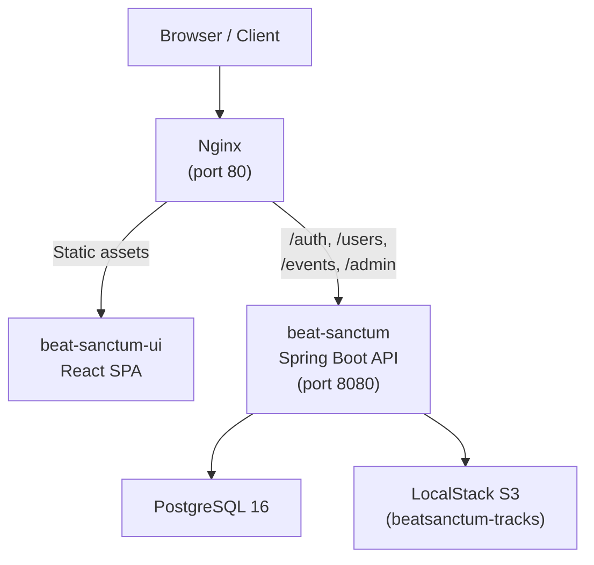
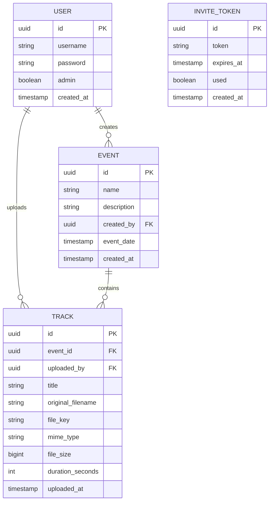
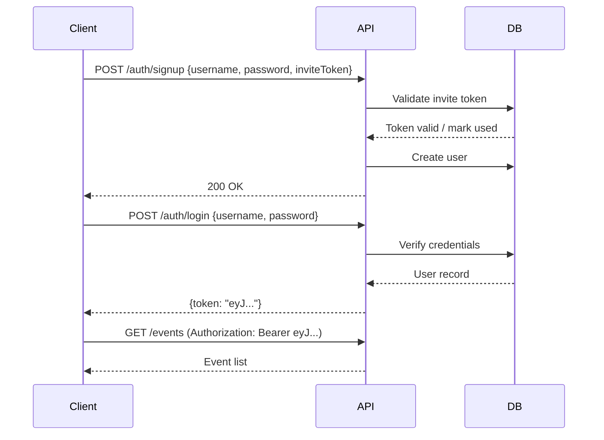

# Beat Sanctum

An open source, event-based private music hosting platform. Organizers create events, artists upload tracks, and listeners stream directly from the browser. An account is required to access the platform — registration is invite-only via an admin.

## Architecture



### Services

| Service | Image | Purpose |
|---|---|---|
| `beat-sanctum-ui` | Built from `../beat-sanctum-ui` | Nginx serving the React SPA + API reverse proxy |
| `beat-sanctum-app` | Built from `.` | Spring Boot REST API |
| `postgres` | `postgres:16` | Persistent relational data |
| `localstack` | `localstack/localstack:3` | S3-compatible audio file storage |

## Data Model



## Authentication Flow

Registration requires an invite token. Once registered, all subsequent requests are authenticated with a short-lived JWT passed as a `Bearer` token.



## API Reference

### Authentication

| Method | Endpoint | Auth | Description |
|---|---|---|---|
| `POST` | `/auth/signup` | — | Register with invite token |
| `POST` | `/auth/login` | — | Login, returns JWT |

**Signup body:** `{ "username": "...", "password": "...", "inviteToken": "..." }`  
**Login body:** `{ "username": "...", "password": "..." }`  
**Login response:** `{ "token": "eyJ..." }`

### Users

| Method | Endpoint | Auth | Description |
|---|---|---|---|
| `GET` | `/users/me` | Required | Get current user details |

### Events

| Method | Endpoint | Auth | Description |
|---|---|---|---|
| `GET` | `/events` | Required | List all events |
| `GET` | `/events/{id}` | Required | Get event details |
| `POST` | `/events` | Required | Create a new event |
| `DELETE` | `/events/{id}` | Required | Delete an event |

**Create event body:** `{ "name": "...", "description": "...", "eventDate": "2025-06-01T20:00:00" }`

### Tracks

| Method | Endpoint | Auth | Description |
|---|---|---|---|
| `GET` | `/events/{eventId}/tracks` | Required | List tracks for an event |
| `GET` | `/events/{eventId}/tracks/{trackId}` | Required | Get track metadata |
| `GET` | `/events/{eventId}/tracks/{trackId}/stream` | Required | Stream audio |
| `POST` | `/events/{eventId}/tracks` | Required | Upload a track (multipart, max 50 MB) |
| `DELETE` | `/events/{eventId}/tracks/{trackId}` | Required | Delete a track |

**Upload form fields:** `title` (string), `file` (audio/mpeg or audio/wav, max 50 MB)

### Admin

Invite token management is available to admin users under `/admin`.

Interactive API docs are available at `http://localhost:8080/swagger-ui.html` when running locally.

## Tech Stack

- **Java 21** + **Spring Boot 4**
- **Spring Security** with JWT (JJWT 0.12.6)
- **Spring Data JPA** + **Flyway** migrations
- **PostgreSQL 16**
- **AWS S3 SDK v2** (LocalStack for local dev)
- **SpringDoc OpenAPI** (Swagger UI)
- **Docker** + **Docker Compose**

## Deployment

Both `beat-sanctum` (this repo) and [`beat-sanctum-ui`](https://github.com/your-org/beat-sanctum-ui) must be cloned as siblings in the same parent directory, since the Docker Compose build references `../beat-sanctum-ui`.

```
parent/
├── beat-sanctum/       ← this repo
└── beat-sanctum-ui/    ← frontend repo
```

### 1. Clone both repos

```bash
git clone https://github.com/your-org/beat-sanctum.git
git clone https://github.com/your-org/beat-sanctum-ui.git
```

### 2. Configure environment

```bash
cd beat-sanctum
cp .env.example .env
```

Edit `.env`:

```env
POSTGRES_USER=beatsanctum
POSTGRES_PASSWORD=changeme
JWT_SECRET=your-secret-key-at-least-32-chars
```

### 3. Start the stack

```bash
docker compose up --build -d
```

This builds and starts all four services. The app is available at `http://localhost`.

### 4. Updating

```bash
cd beat-sanctum && git pull
cd ../beat-sanctum-ui && git pull
cd ../beat-sanctum && docker compose up --build -d
```

### Ports

| Port | Service |
|---|---|
| `80` | Nginx (UI + API proxy) — primary entry point |
| `8080` | Spring Boot API (internal only) |
| `5432` | PostgreSQL (internal only) |
| `4566` | LocalStack S3 (internal only) |

## Local Development

Run the backend standalone (without Docker):

```bash
# Start dependencies only
docker compose up postgres localstack -d

# Run the app
./gradlew bootRun
```

The API will be available at `http://localhost:8080`.

## License

MIT
